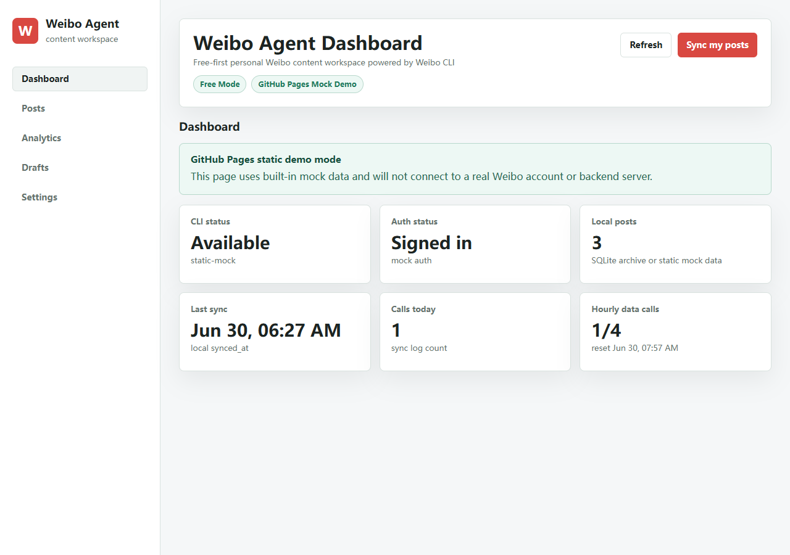
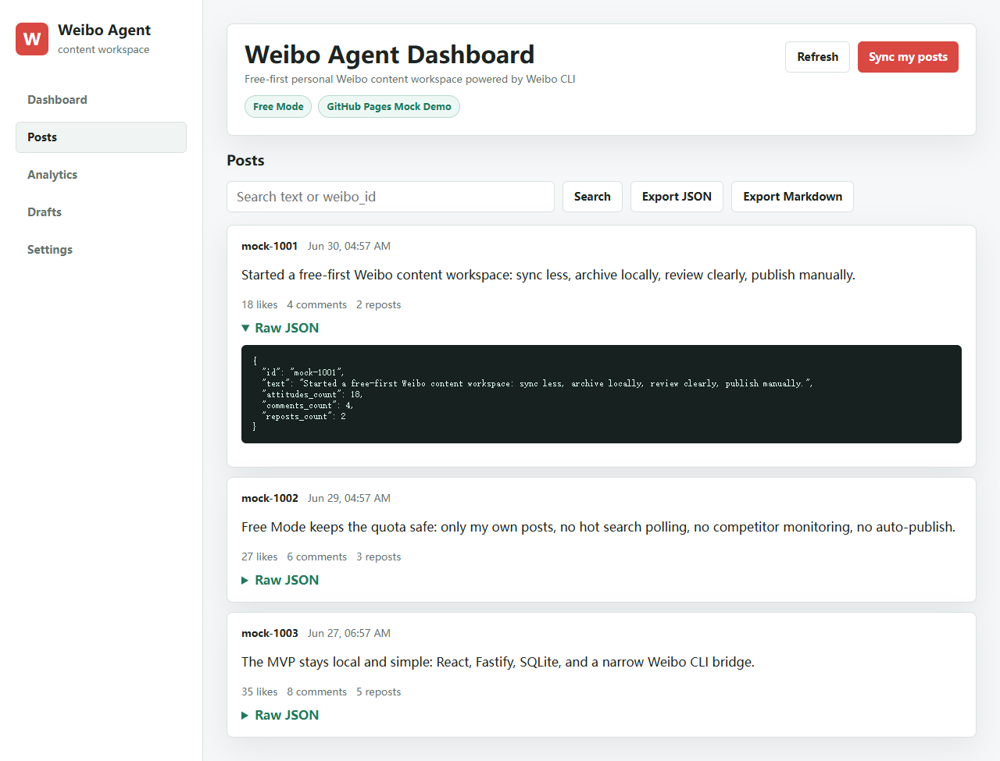
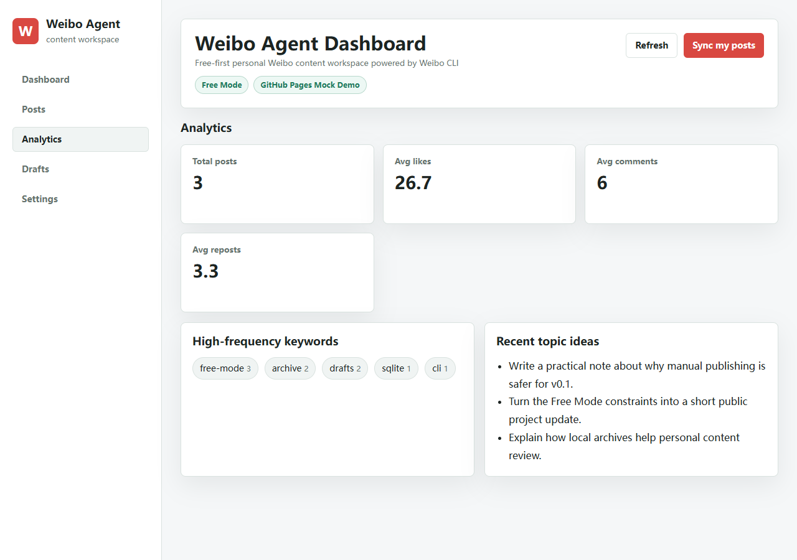
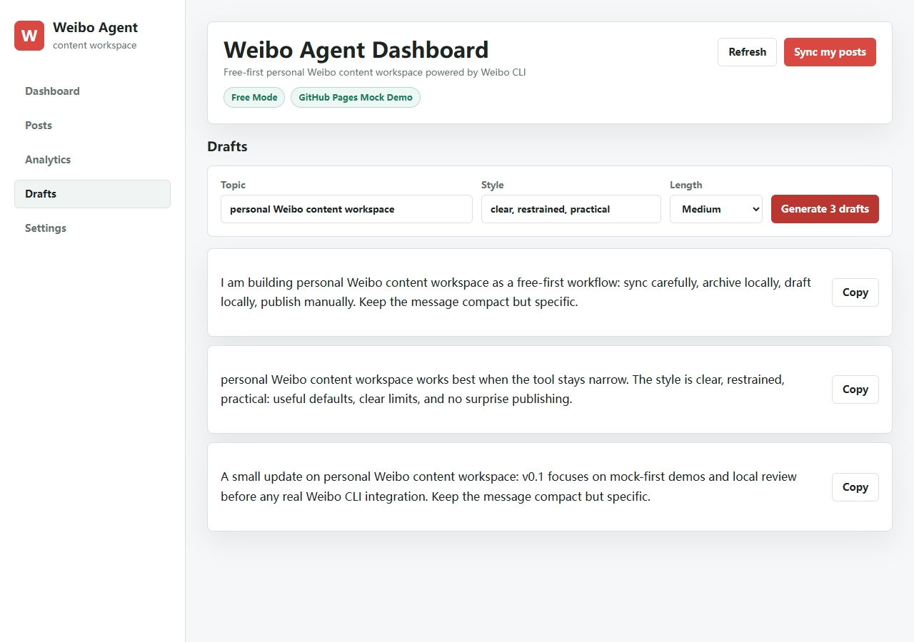

# Weibo Agent Dashboard

Free-first Weibo CLI personal content dashboard for archive, analytics, and draft generation.

Weibo Agent Dashboard is a small personal open-source project for syncing your own Weibo posts, archiving them locally, reviewing lightweight analytics, and generating draft posts for manual copy/paste publishing. It is mock-first for public demos and read-only for real CLI smoke testing.

- Repository: https://github.com/conanxin/weibo-agent-dashboard
- Live Demo: https://conanxin.github.io/weibo-agent-dashboard/

## Screenshots

Dashboard:



Posts:



Analytics:



Drafts:



## Core Features

- React + Vite web dashboard with Dashboard, Posts, Analytics, Drafts, and Settings views.
- Fastify API server for local full-stack use.
- SQLite local archive for synced posts, generated drafts, and sync logs.
- Whitelisted Weibo CLI bridge only: no arbitrary shell execution.
- Mock mode for demos, development, CI, and GitHub Pages.
- Free Mode posture: low-frequency calls, current-user data only, no auto-publishing.
- JSON and Markdown export from the local post archive.

## Runtime Modes

| Mode | Where it runs | Data source | Backend required | Intended use |
| --- | --- | --- | --- | --- |
| Mock Demo | GitHub Pages or local Vite | Built-in mock data | No | Public showcase |
| Local Server | Your machine | Mock data or local SQLite | Yes | Full local workflow |
| Tencent Cloud | Personal Ubuntu server | Fastify + SQLite + static frontend | Yes | Full backend mode |
| Real Weibo CLI | Local/Tencent backend | Official Weibo CLI | Yes | Read-only smoke testing |

## Architecture

```text
GitHub Pages static demo
        |
        | VITE_MOCK_MODE=1
        v
apps/web -----------------------+
React + Vite                    |
                                |
Local full-stack mode           |
        | HTTP /api             |
        v                       |
apps/server                     |
Fastify + SQLite                |
        | whitelist calls       |
        v                       |
packages/weibo-bridge           |
execa -> official Weibo CLI     |
```

## Local Start

Install dependencies:

```bash
npm install
```

Run the full local app:

```bash
npm run dev
```

Default local URLs:

- Web app: `http://localhost:5173`
- API server: `http://localhost:3000`

Production-style local run:

```bash
npm run build
npm run start
```

Then open `http://localhost:3000`.

## Mock Mode

Backend mock mode is enabled in `.env.example`:

```env
MOCK_WEIBO=1
FREE_MODE=1
```

Copy `.env.example` to `.env` for local backend use. When `MOCK_WEIBO=1`, the server never calls the real Weibo CLI and returns sample user/post data.

Frontend static demo mode is controlled by:

```env
VITE_MOCK_MODE=1
```

When `VITE_MOCK_MODE=1`, `apps/web` does not call the backend. It renders built-in mock status, posts, analytics, and draft generation data.

## GitHub Pages Static Demo

GitHub Pages can only run the mock demo because it is a static hosting environment. It cannot run the Fastify server, create or read SQLite databases, access local `.env` files, or execute `weibo`.

The Pages workflow builds only `apps/web` with:

```env
VITE_MOCK_MODE=1
VITE_BASE_PATH=/weibo-agent-dashboard/
```

This produces a static demo for:

```text
https://conanxin.github.io/weibo-agent-dashboard/
```

Manual local static demo:

```powershell
$env:VITE_MOCK_MODE="1"
npm run dev -w apps/web
```

Open `http://localhost:5173`.

## Free Mode

The project assumes a conservative free-tier posture:

- Treat the Weibo CLI Free edition as 5 calls per hour.
- Limit backend data calls to 4 per hour.
- Only sync the current user's own data.
- Do not fetch hot searches by default.
- Do not perform full-network search by default.
- Do not monitor competitor accounts by default.
- Do not auto-publish posts.

See [docs/FREE_MODE.md](docs/FREE_MODE.md).

## Real CLI Smoke Test (v0.4.0)

The project includes a probe script and a read-only smoke test for the real Weibo CLI bridge.

### Probe — detect the binary and read-only commands

```bash
npm run probe:weibo-cli
# or with an explicit binary
WEIBO_CLI_BIN=weibo npm run probe:weibo-cli
```

The probe detects which CLI binary is present (`weibo`, `weibo-cli`, or `wb`) and refuses to shadow wandb. It then probes a prioritized set of read-only commands using `--output json` (the official flag, not legacy `--json`):

- `weibo version`
- `weibo doctor`
- `weibo doctor --output json`
- `weibo auth --help`
- `weibo auth whoami`
- `weibo auth whoami --output json`
- `weibo me`
- `weibo me --output json`
- `weibo commands list`
- `weibo commands list --output json`

It also probes legacy shapes (`auth status`, `posts mine`, `user timeline`) as informational, downgraded candidates. The probe writes a structured JSON report to `reports/weibo-cli-probe-latest.json`.

Readiness categories:

| Category | Meaning |
| --- | --- |
| `CLI_NOT_FOUND` | No Weibo CLI on `PATH`. |
| `WAND_DETECTED` | Only `wb` (Weights & Biases) was found; install weibo independently. |
| `CLI_INSTALLED_BUT_NOT_READY` | Binary works but `doctor.ready=false` (login / developer verification / subscription incomplete). |
| `CLI_READY_FOR_REAL_CLI_MODE` | `doctor.ready=true`. |

### Smoke — exercise the bridge in real-CLI mode

```bash
MOCK_WEIBO=0 WEIBO_CLI_BIN=weibo npm run test:real-cli:smoke
```

Outcomes:

- `SKIP` — mock mode active, or CLI not found, or wandb detected.
- `UNAVAILABLE` — CLI installed but `doctor.ready=false`. **Not a project failure.**
- `PASS` — `doctor.ready=true`; runs `getAuthStatus`, `getCurrentUser`, and `syncMyPosts(5)`.

In v0.4.0, `syncMyPosts` is intentionally uncalibrated and returns `code: COMMAND_NOT_CALIBRATED`. The smoke treats that as an acceptable signal. After login, run `weibo commands list --output json` to discover the right sync shape and update `REAL_CLI_COMMANDS.myPosts`.

### Switching to real CLI mode

1. Install the official CLI independently (do not overwrite `wb` / wandb):

```bash
npm install -g @weibo-ai/weibo-cli --prefix ~/.local/weibo-cli
ln -sf ~/.local/weibo-cli/bin/weibo ~/.local/bin/weibo
export PATH="$HOME/.local/bin:$PATH"
```

2. Log in:

```bash
weibo auth login            # browser
weibo auth login --device   # SSH / headless / CI
```

If you see `SLOW_DOWN`, wait **2–5 minutes** and retry.

3. Copy `.env.example` to `.env` and set:

```env
MOCK_WEIBO=0
FREE_MODE=1
WEIBO_CLI_BIN=weibo
```

4. Run the probe and smoke test:

```bash
WEIBO_CLI_BIN=weibo npm run probe:weibo-cli
MOCK_WEIBO=0 WEIBO_CLI_BIN=weibo npm run test:real-cli:smoke
```

5. Build and start:

```bash
npm run build
npm run start
```

v0.4.0 remains read-only. It does not post, comment, repost, search the public network, fetch hot searches, or monitor competitor accounts.

## CLI Command Calibration

`REAL_CLI_COMMANDS` in `packages/weibo-bridge/src/index.ts` is calibrated against the official Weibo CLI:

- `weibo doctor --output json` — canonical readiness signal.
- `weibo auth whoami --output json` — current authenticated user (primary).
- `weibo me --output json` — fallback for older CLI builds.
- `myPosts` — intentionally uncalibrated in v0.4.0. Returns `COMMAND_NOT_CALIBRATED` until you log in, run `weibo commands list --output json`, and update the mapping.

See [docs/WEIBO_CLI_ADAPTER.md](docs/WEIBO_CLI_ADAPTER.md) for the full mapping, the readiness categories, the SLOW_DOWN recovery flow, and the redaction policy.

## Public Demo Health (v0.2.1)

v0.2.1 hardens the public demo path:

- Explicit GitHub Pages base path support through `VITE_BASE_PATH`.
- Pages workflow uses `VITE_MOCK_MODE=1`.
- Dashboard and Settings clearly identify GitHub Pages as Mock Demo mode.
- `npm run check:public-demo` verifies README links, dist files, asset references, and Pages workflow settings without network access.

## Showcase Screenshots (v0.2.2)

v0.2.2 adds real README screenshots captured from the static mock demo:

```bash
npm run screenshots
```

## Tencent Cloud Lite (v0.3.0)

GitHub Pages = Static Mock Demo. Tencent Cloud = Full backend mode.

Shortest server path:

```bash
git clone https://github.com/conanxin/weibo-agent-dashboard.git
cd weibo-agent-dashboard
cp .env.example .env
npm install
npm run build
npm run start
```

Then open:

```text
http://SERVER_IP:3000
```

Health check:

```bash
npm run check:server-health
```

See [docs/DEPLOY_TENCENT_CLOUD.md](docs/DEPLOY_TENCENT_CLOUD.md).

This project intentionally avoids Docker, Nginx, HTTPS, backups, and rollback workflows for v0.3.x.

## Security Notes

- Do not commit `.env`.
- Do not commit `data/*.sqlite`.
- Do not commit `node_modules` or `dist`.
- Weibo credentials should remain in the official CLI or local environment only.
- The server exposes fixed API routes and does not provide arbitrary shell execution.

## Roadmap

| Version | Goal | Status |
| --- | --- | --- |
| v0.1.0 | Mock-first local MVP | Complete |
| v0.1.1 | Open-source showcase + GitHub Pages demo | Complete |
| v0.2.0 | Real Weibo CLI read-only smoke test | Complete |
| v0.2.1 | Public demo health and GitHub Pages hardening | Complete |
| v0.2.2 | Showcase screenshots | Complete |
| v0.3.0 | Tencent Cloud Lite deployment | Complete |
| v0.4.0 | Real Weibo CLI calibration | Current |
| v0.5.0 | AI draft enhancement / content intelligence | Planned |

See [docs/ROADMAP.md](docs/ROADMAP.md).

## License

MIT. See [LICENSE](LICENSE).
